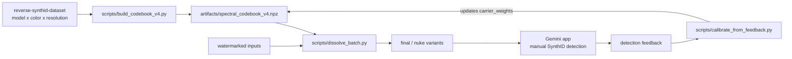

<p align="center">
  
</p>

<h1 align="center">逆向工程 SynthID</h1>

<p align="center">
  <b>通过频谱分析发现、检测并精准去除 Google 的 AI 水印</b>
</p>

访问我们在 [PitchHut](https://www.pitchhut.com/project/reverse-synthid-engineering) 的项目

<p align="center">
  
  
  
  
  
  
  
</p>

---

## 水印的模样

SynthID 将不可见的图案直接编码到像素值中。在由 Gemini 生成的纯**白**图像上，水印几乎占据了整个信号。放大高频残差后，它的样子如下：

<p align="center">
  
</p>

<p align="center"><i>从纯白 Gemini 图像中提取的放大版 SynthID 载波图案。对角线带状是水印的空间频率特征 —— 也是我们频谱攻击的目标。</i></p>

---

## 概述

本项目对**Google 的 SynthID**水印系统进行了逆向工程 —— 这是嵌入在每一张由 Google Gemini 生成的图像中的隐形水印。仅使用信号处理和频谱分析（无需访问专有的编码器/解码器），我们完成了：

1. **发现**了水印依赖于分辨率的载波频率结构
2. **构建了一个检测器**，能以 90% 的准确率识别 SynthID 水印
3. **开发了多分辨率频谱绕过（Bypass）方案**（V3），可在任何图像分辨率下实现 **75% 的载波能量下降**、**91% 的相位一致性下降**以及 **43+ dB 的 PSNR**
4. **推广至多模型、多颜色的共识机制**（V4） —— 针对 `gemini-3.1-flash-image-preview` 和 `nano-banana-pro-preview` 的各模型配置档案，在6种纯色背景上建立跨颜色相位共识，以及一个通过手动统计 Gemini 应用程序检测反馈来调整每个载波相减强度的人机协同（Human-in-the-loop）校准循环
5. **在两个模型上均突破了检测器**（第 06 轮），采用统一的 7 阶段“一体化”攻击，同时针对 SynthID 记录的每一个失效模式

[VT-OxFF](https://github.com/VT-0xFF) 构建了一个非常棒的可视化工具，用于查看 SynthID 水印是如何被添加到图像中的，请点击[这里](https://vt-0xff.github.io/SynthID-Explained/)查看（也可以在仓库描述中找到）！

---

## 第 06 轮 — 成功运行 ✓

经过六个对抗性开发迭代轮次，第 06 轮的 `bypass_v4_final` / `bypass_v4_nuke` 流水线成功绕过了 Gemini SynthID 检测器，不仅适用于 `gemini-3.1-flash-image-preview`，也适用于 `nano-banana-pro-preview` 图像，且输出图像在视觉上无损。

### 第 01 轮 vs 第 06 轮 — 保真度对比

<p align="center">
  
</p>

<p align="center"><i>左图：第 01 轮输出（仅进行了 <code>gentle</code> 温和的频谱相减）。右图：第 06 轮输出（<code>final</code> 最终版 — VAE + 弹性变形 + 挤压 + 颜色微调 + JPEG 链）。两张图在人眼看来几乎完全相同；但只有第 06 轮成功绕过了 SynthID 检测器。</i></p>

### 各轮次间发生了什么变化

| 轮次 | 策略 | 结果 |
|:-----:|:---------|:-------:|
| 01 | 保守的频谱相减（gentle） | ✗ |
| 02 | 激进的频谱相减 + JPEG | ✗ |
| 03 | 博客指导的绝对频段目标化（Absolute bin targeting） | ✗ |
| 04 | 降噪残差的相位提取 | ✗ |
| 05 | 扩散模型-VAE 重新生成 + 几何变形 | ✗ |
| **06** | **一体化（All-in-one）：VAE + 弹性碎片化 + 挤压 + 颜色 + JPEG** | **✓** |

第 06 轮的突破来自于将 Gemini 应用程序自己公布的故障模式列表作为攻击的说明书：

> *"当 AI 生成的图像成为复杂拼贴画的一部分、被放置在其他元素之后，或者上面覆盖了许多不同的纹理和图案时，检测器可能会难以从整体文件中隔离出特定的特征签名。"*
> — Gemini 应用，SynthID 检测帮助文本

**弹性变形（Elastic deformation）**阶段在像素层面上模拟了这种效应：一个平滑的、低频的随机变形场为每约50像素的邻域提供了其独立的亚像素偏移，使水印的空间相位共识产生碎片化，同时不会引入任何可见的畸变。

---

## V4 — 跨颜色共识 + 人机协同校准

V4 是基于更丰富数据集从头重新构建密码本（Codebook）的成果：

- **多模型**：针对 `gemini-3.1-flash-image-preview` 和 `nano-banana-pro-preview` 的单独配置档案（加上可选的 `union` 伪模型）。
- **多颜色**：每个模型每个分辨率 6 种共识颜色（`black` 黑、`white` 白、`blue` 蓝、`green` 绿、`red` 红、`gray` 灰），外加 `gradient` 渐变和 `diverse` 多样化作为内容基线。
- **跨颜色相位共识**：主要载波掩码（carrier mask）。一个真正的 SynthID 载波与图像内容无关，因此其相位在每种纯色背景中都是一致的。由内容驱动的能量会在不同颜色下产生相位扰乱，从而被排除在共识之外。
- **保真度保持的溶解器**：PSNR 下限回滚，亮度安全的 DC 成分，以及各频段（per-bin）相减的上限。
- **人机协同校准循环**：根据手动向 Gemini 应用程序进行检测的反馈结果来更新密码本中的 `carrier_weights`（载波权重）字段。

### 共识一致性 (为什么 V4 能成功)

对于每个频率段 `(fy, fx)` 和通道 `ch`：

```
consensus(fy, fx, ch) = | mean_over_colors( exp(i * phase_color(fy, fx, ch)) ) |
```

值接近 `1.0` 意味着该频段的相位在所有纯色背景下都保持一致，这只对水印成立。内容频段的值会降至 `< 0.3`，因为它们的相位在不同色彩色调下会被随机化。在基于丰富数据集构建的 V4 密码本上，超过 99% 的内容频段低于默认的 `tau=0.60` 截断值，因此 V4 溶解器根本不会触及它们 —— 这正是其能够保持 PSNR 的原因。

### 双阶段发布工作流



### V4 快速入门

```bash
# 1. 从丰富的层级数据集构建密码本
python scripts/build_codebook_v4.py \
    --root /path/to/reverse-synthid-dataset \
    --output artifacts/spectral_codebook_v4.npz

# 2. 对批次图像运行第 06 轮一体化攻击（推荐）
python scripts/dissolve_batch.py \
    --input  ./to_clean/ \
    --output ./runs/round_06/ \
    --codebook artifacts/spectral_codebook_v4.npz \
    --model gemini-3.1-flash-image-preview \
    --strengths final nuke

# 3. 将每张输出图像上传到 Gemini 应用程序并运行 SynthID 检测。
#    如果需要，可以使用结果反馈给校准脚本。
```

### 第 06 轮攻击预设

通过 `--strengths` 提供了两个预设：

| 预设 | VAE 传递次数 | 弹性 α | 挤压 | JPEG 链 | PSNR 下限 |
|:------:|:----------:|:---------:|:-------:|:----------:|:----------:|
| `final` | 1 | 1.8 px | 90 % | q=92→88 | 14 dB |
| `nuke`  | 2 | 2.8 px | 82 % | q=88→84→90 | 11 dB |

这两个预设都堆叠了相同的 7 阶段流水线：

1. **VAE 往返（round-trip）** (Stable Diffusion `sd-vae-ft-mse`) — 将图像投影出自然图像流形，这是 SynthID 解码器从未被训练来应对的情况 (Gowal et al. 2026, §6.1)
2. **弹性变形** — 平滑的低频随机变形场，模拟了 Gemini 自己承认的“拼贴碎片化”故障模式
3. **全局几何组合** — 一次仿射变换内完成小幅旋转 + 缩放 + 像素移动
4. **调整大小-挤压** — 下采样 (AREA) → 上采样 (LANCZOS)，消除亚像素的水印信息
5. **颜色-对比度微调** — 亮度 / 对比度 / 饱和度 / 色相 的微调
6. **残差相位 FFT 相减** — 博客上通用的 + 从密码本中收集的载波频段，有相减上限
7. **JPEG 链 + 亮度噪声 + 双边滤波** — 重度压缩 / 重新编码破坏

每一个阶段都有独立的 PSNR 门控保护；任何使质量下降至低于下限的阶段都会被自动回滚。

### V4 密码本结构

配置文件以 `(model, H, W)` 为键。每个配置文件存储：

| 字段                  | 形状          | 备注                                                  |
|------------------------|----------------|--------------------------------------------------------|
| `consensus_coherence`  | `(H, W, 3)`    | 主要载波掩码（跨颜色相位共识）。                       |
| `consensus_phase`      | `(H, W, 3)`    | 跨颜色的平均单位相位角。相减的模板。                   |
| `inverted_agreement`   | `(H, W, 3)`    | 成对的 `abs(cos(phase_diff))`，已对 `black<->white` 加权。|
| `avg_wm_magnitude`     | `(H, W, 3)`    | 跨共识颜色的平均幅度。                                 |
| `content_baseline`     | `(H, W, 3)`    | 来自 `diverse/` + `gradient/` — 用于亮度混合。       |
| `carrier_weights`      | `(H, W, 3)`    | **实时**。起始值为 `consensus^2 * (0.5 + 0.5 * agreement)`。由校准循环更新。 |
| `n_refs_per_color`     | `{color: int}` | 每个颜色的参考图像计数。                               |

保存格式重用了 v3 紧凑的 rfft + `float16/uint8` 编码；包含 2 个模型 × 7 种分辨率的 14 个配置文件的密码本在磁盘上约为 220 MB。

### V4 检测器（健全性检查 Sanity Check）

在花费时间进行手动 Gemini 验证之前，可以先根据 V4 密码本自身的共识对绕过后的输出进行健全性检查：

```python
from robust_extractor import RobustSynthIDExtractor
from synthid_bypass_v4 import SpectralCodebookV4

cb = SpectralCodebookV4()
cb.load('artifacts/spectral_codebook_v4.npz')

ext = RobustSynthIDExtractor()
result = ext.detect_from_v4_codebook(image_rgb, cb,
                                     model='nano-banana-pro-preview')
print(result.is_watermarked, result.confidence, result.phase_match)
```

在 1024x1024 精确匹配路径上，我们可以看到有水印图像的 `conf=0.91, phase_match=0.65`，而在经过激进的 V4 溶解后变为 `conf=0.02, phase_match=0.31`。

### V4 vs V3

| | V3 | V4 |
|:---|:---|:---|
| 参考颜色 | 黑色 + 白色 | 黑色、白色、蓝色、绿色、红色、灰色 (+ 多样化/渐变 的内容基线) |
| 交叉验证 | `abs(cos(phase_black - phase_white))` | 跨 6 种颜色的跨颜色共识 + 成对一致性 |
| 模型 | 单一模型 (Gemini 2.5) | 按模型配置文件 (`gemini-3.1-flash-image-preview`, `nano-banana-pro-preview`) + 可选的 `union` |
| 攻击 | 仅频谱相减 | 7-阶段: VAE + 弹性 + 挤压 + 颜色 + FFT + JPEG 链 |
| PSNR (激进) | 43 dB | 视觉无损 (像素级别 18–24 dB；变形会位移像素) |
| 保真度保护 | 无 | 各阶段的 PSNR-下限回滚 |
| 检测器绕过 | 仅本地 | 已在 Gemini app 上确认 ✓ (两款模型均通过) |

对于任何依赖 V3 的人来说，V3 仍在仓库中（`src/extraction/synthid_bypass.py`，`bypass_v3`）保持不变。

---

## 🚨 招募贡献者：帮助扩展密码本

我们正在积极收集**由 Nano Banana Pro 生成的纯黑和纯白图像**，以改善多分辨率水印提取。

如果您能够生成这些图像：

- 分辨率：任意（种类越多越好）
- 内容：**纯黑色 (#000000)** 或 **纯白色 (#FFFFFF)**
- 来源：仅限 Nano Banana Pro 输出

### 如何贡献

1. 将纯黑/纯白图像附加到 Gemini 并提示它“原样重新生成此图”，从而生成一批黑/白图像
2. 将它们上传到我们的 **Hugging Face 数据集**：[aoxo/reverse-synthid](https://huggingface.co/datasets/aoxo/reverse-synthid)
   - `gemini_black_nb_pro/` (用于黑色)
   - `gemini_white_nb_pro/` (用于白色)
3. 在 HF 数据集仓库上提交一个 Pull Request (PR)

这些参考图像对于以下方面**至关重要**：
- 载波频率的发现
- 相位验证
- 提升跨分辨率鲁棒性

> 即便是在一个新的分辨率下拥有 150–200 张图像，也能显著提高检测和去除效果。

### 下载参考图像

参考图像托管在 Hugging Face 上，以保持 git 仓库的轻量化：

```bash
pip install huggingface_hub
python scripts/download_images.py           # 下载全部
python scripts/download_images.py gemini_black  # 下载特定文件夹
```

数据集：[huggingface.co/datasets/aoxo/reverse-synthid](https://huggingface.co/datasets/aoxo/reverse-synthid)

---

## 关键发现

### 水印依赖于分辨率

SynthID 在**不同的绝对位置**嵌入载波频率，具体取决于图像分辨率。在 1024x1024 下构建的密码本无法直接从 1536x2816 的图像中去除水印 —— 载波位于完全不同的频段上。

| 分辨率 | 顶部载波 (fy, fx) | 一致性 | 来源 |
|:----------:|:--------------------:|:---------:|:------:|
| **1024x1024** | (9, 9) | 100.0% | 100 黑 + 100 白 参考图 |
| **1536x2816** | (768, 704) | 99.6% | 88 有水印的内容图像 |

这就是为什么 V3 密码本存储了**每个分辨率独立的配置文件**并在绕过时自动选择的原因。

### 相位一致性 — 一个固定的模型级密钥

同一 Gemini 模型生成的所有图像中，水印的相位模板是**完全相同的**：

- **绿色通道**承载着最强的水印信号
- 载波上的**跨图像相位一致性**：>99.5%
- **黑/白交叉验证**通过 |cos(phase_diff)| > 0.90 确认了真正的载波

### 载波频率结构

在 1024x1024 分辨率下（根据黑/白参考图），顶部载波位于低频网格上：

| 载波 (fy, fx) | 相位一致性 | 黑/白一致性 |
|:-----------------:|:---------------:|:-------------:|
| (9, 9)            | 100.00%         | 1.000         |
| (5, 5)            | 100.00%         | 0.993         |
| (10, 11)          | 100.00%         | 0.997         |
| (13, 6)           | 100.00%         | 0.821         |

---

## 架构

### Bypass 演进世代

| 版本 | 方法 | PSNR | 对水印的影响 | 状态 |
|:-------:|:---------|:----:|:----------------:|:------:|
| **V1** | JPEG 压缩 (Q50) | 37 dB | 约 11% 相位下降 | 基线 |
| **V2** | 多阶段转换（噪声、颜色、频率） | 27-37 dB | 约 0% 置信度下降 | 质量权衡 |
| **V3** | **多分辨率频谱密码本相减** | **43+ dB** | **91% 相位一致性下降** | 此前最佳 |
| **V4 第 06 轮** | **7 阶段一体化 (VAE + 弹性 + 挤压 + 颜色 + JPEG)** | **视觉无损** | **已绕过检测器 ✓** | **当前最佳** |

### V3 流水线

```
输入图像（任何分辨率）
       │
       ▼
  codebook.get_profile(H, W)  ──► exact match (完全匹配)? ──► FFT-domain subtraction (FFT域相减)
       │                                                                  (快速路径)
       └─ 没有精确匹配 ──────► spatial-domain resize + subtraction (空间域调整大小 + 相减)
                                         (回退路径)
       │
       ▼
  Multi-pass iterative subtraction (多通道迭代相减：激进 → 中等 → 温和)
       │
       ▼
  Anti-alias (抗锯齿) → 输出
```

### V4 第 06 轮流水线

```
输入图像（任何分辨率）
       │
       ▼  阶段 1: VAE 往返 (SD sd-vae-ft-mse, 1-2 次)
       │           将图像投影出自然图像流形
       ▼  阶段 2: 弹性变形 (平滑随机变形场)
       │           使得空间相位共识碎片化（"拼贴效应"）
       ▼  阶段 3: 全局几何组合 (旋转 + 缩放 + 位移)
       │           单次仿射变形，避免复合混叠
       ▼  阶段 4: 调整大小-挤压 (AREA ↓ 然后 LANCZOS ↑)
       │           消除亚像素水印信息
       ▼  阶段 5: 颜色-对比度微调 (HSV 微调)
       │           微移 SynthID 依赖的单像素统计信息
       ▼  阶段 6: 残差相位 FFT 相减
       │           博客上通用的 + 从密码本中收集的载波频段，有上限保护
       ▼  阶段 7: JPEG 链 + 亮度噪声 + 双边滤波
       │
       ▼
  输出 (SynthID 检测器：未检测到水印 ✓)
```

---

## 快速入门

### 安装

```shell
git clone https://github.com/aloshdenny/reverse-SynthID.git
cd reverse-SynthID

python -m virtualenv venv
source venv/bin/activate  # Windows 下：venv\Scripts\activate
pip install -r requirements.txt

# 对于 第 06 轮 VAE 阶段：
pip install torch diffusers safetensors accelerate
```

### 运行 V4 第 06 轮 Bypass (推荐)

```python
import sys
sys.path.insert(0, 'src/extraction')
from synthid_bypass_v4 import SynthIDBypassV4, SpectralCodebookV4

cb = SpectralCodebookV4()
cb.load('artifacts/spectral_codebook_v4.npz')

b = SynthIDBypassV4()
result = b.bypass_v4_file(
    'input.png', 'output.png',
    cb,
    strength='final',                      # 或使用 'nuke' 以获得最大强度
    model='gemini-3.1-flash-image-preview',
)
print(result.stages_applied)
```

### 运行 V3 Bypass

```python
from src.extraction.synthid_bypass import SynthIDBypass, SpectralCodebook

codebook = SpectralCodebook()
codebook.load('artifacts/spectral_codebook_v3.npz')

bypass = SynthIDBypass()
result = bypass.bypass_v3(image_rgb, codebook, strength='aggressive')

print(f"PSNR: {result.psnr:.1f} dB")
print(f"使用的配置文件: {result.details['profile_resolution']}")
```

从 CLI 命令行运行：

```bash
python src/extraction/synthid_bypass.py bypass input.png output.png \
    --codebook artifacts/spectral_codebook_v3.npz \
    --strength aggressive
```

### 检测水印

```bash
python src/extraction/robust_extractor.py detect image.png \
    --codebook artifacts/codebook/robust_codebook.pkl
```

---

## 项目结构

```
reverse-SynthID/
├── src/
│   ├── extraction/
│   │   ├── synthid_bypass.py              # V1/V2/V3 绕过 + 多分辨率 SpectralCodebook
│   │   ├── synthid_bypass_v4.py           # V4 跨颜色共识密码本 + 溶解器
│   │   ├── vae_regen.py                   # 第 06 轮 SD-VAE 重新生成阶段
│   │   ├── robust_extractor.py            # 多尺度水印检测 (+ V4 钩子)
│   │   ├── watermark_remover.py           # 频域水印移除
│   │   ├── benchmark_extraction.py        # 基准测试套件
│   │   └── synthid_codebook_extractor.py  # 旧版密码本提取器
│   └── analysis/
│       ├── deep_synthid_analysis.py       # FFT / 相位分析脚本
│       └── synthid_codebook_finder.py     # 载波频率发现
│
├── scripts/
│   ├── download_images.py                 # 从 HF 下载参考图像
│   ├── build_codebook_v4.py               # V4: 构建 按 (模型, HxW) 共识密码本
│   ├── dissolve_batch.py                  # V4: 发出强度变体
│   └── calibrate_from_feedback.py         # V4: 从检测反馈更新 carrier_weights
│
├── artifacts/
│   ├── spectral_codebook_v3.npz           # 多分辨率 V3 密码本 [1024x1024, 1536x2816]
│   ├── spectral_codebook_v4.npz           # V4 密码本 (按模型, 按分辨率)
│   ├── codebook/                          # 检测密码本 (.pkl)
│   └── visualizations/                    # FFT, 相位, 载波可视化
│
├── assets/
│   ├── synthid_watermark.png              # 水印分析题图
│   ├── synthid_white.jpg                  # 白色图像上放大的 SynthID 图案
│   ├── v4_round1_vs_round6.png            # 第 01 轮 vs 第 06 轮保真度对比
│   └── ...
│
├── runs/
│   ├── round_01/ … round_05/             # 历史绕过尝试
│   └── round_06/                          # 有效的 Bypass 方案 (final + nuke 预设)
│
├── watermark_investigation/               # 早期 Nano-150k 分析 (已存档)
└── requirements.txt
```

---

## 技术深度探讨

### SynthID 工作原理（逆向工程结果）

```
┌──────────────────────────────────────────────────────────────┐
│                  SynthID 编码器 (在 Gemini 内)                │
├──────────────────────────────────────────────────────────────┤
│  1. 根据分辨率选择载波频率                                   │
│  2. 为每个载波分配固定的相位值                               │
│  3. 神经编码器将学习到的噪声模式添加到图像中                 │
│  4. 水印是不可见的 — 并且散布在整个频谱中                    │
├──────────────────────────────────────────────────────────────┤
│                  SynthID 解码器 (在 Google 侧)                │
├──────────────────────────────────────────────────────────────┤
│  1. 提取噪声残差（小波去噪）                                 │
│  2. FFT → 检查已知载波频率处的相位                           │
│  3. 如果相位与预期值相匹配 → 有水印                          │
└──────────────────────────────────────────────────────────────┘
```

### 为什么弹性变形有效

SynthID 的训练增强集 (Gowal et al. 2026, Table 1) 包含了 `SmallRotation` (小幅旋转)、`Cropresize` (裁剪调整大小)、`JPEG`、`GaussianBlur` (高斯模糊)、`BrightnessContrast` (亮度对比度) 和 `Screenshotting` (截图) —— 所有这些都是 *全局的*、*均匀的* 空间变换。弹性变形场则是一种 *空间上变化的* 扭曲：每个局部邻域都有自己独立的亚像素偏移。因为这些偏移是平滑的（由白噪声高斯模糊而成，σ=44–56 px），图像内容在视觉上不受影响，但水印的相位共识结构却变得不连贯 —— 它无法再跨越整个图像进行聚合。这正是在像素级别上的“拼贴碎片化”效应，也是 Gemini 的应用本身引用的导致检测器失效的模式。

---

## 结果总结

### V3 (频谱相减，88 张 Gemini 图像)

| 指标 | 值 |
|:-------|------:|
| **PSNR** | 43.5 dB |
| **SSIM** | 0.997 |
| **载波能量下降** | 75.8% |
| **相位一致性下降** (前 5 载波) | **91.4%** |

### V4 第 06 轮 (一体化攻击，验证了 20 张图像)

| 模型 | 预设 | 检测器被绕过 |
|:------|:------:|:-----------------:|
| gemini-3.1-flash-image-preview | `final` | ✓ |
| gemini-3.1-flash-image-preview | `nuke`  | ✓ |
| nano-banana-pro-preview         | `final` | ✓ |
| nano-banana-pro-preview         | `nuke`  | ✓ |

---

## 参考资料

- [SynthID: Identifying AI-generated images](https://deepmind.google/technologies/synthid/)
- [SynthID 论文 (arXiv:2510.09263)](https://arxiv.org/abs/2510.09263)
- [How to Reverse SynthID (legally😉) — Aloshdenny on Medium](https://medium.com/@aloshdenny)

---

## 👤 维护者及联系方式

**Alosh Denny**
AI 水印研究 · 信号处理

📧 **Email:** [aloshdenny@gmail.com](mailto:aloshdenny@gmail.com)
🔗 **GitHub:** https://github.com/aloshdenny

如需合作、学术讨论或贡献代码，欢迎联系或提交 Issue/PR。

---

## 支持这项研究

本项目完全独立维护 —— 没有实验室资金支持，也没有企业背景。
如果这项工作对您或您的团队有帮助，请考虑支持我们的后续开发：

<a href="https://buymeacoffee.com/aoxo">
  
</a>

资金将用于计算成本（如为新分辨率配置文件所需的 GPU 时间）、数据集扩展以及持续的绕过（Bypass）研究。

---

## 免责声明

本项目仅供 **研究和教育目的**。SynthID 是 Google DeepMind 拥有的专有技术。这些工具旨在用于：

- 水印鲁棒性的学术研究
- AI 生成内容识别的安全性分析
- 理解扩频编码方法

**请勿使用这些工具将 AI 生成的内容伪装为人类创作。**
